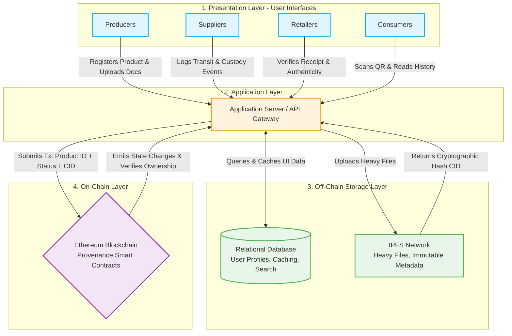

# CSE540 Team 16 Project Blockchain Based Supply Chain Provenance System Smart Contract Design

A hybrid blockchain-based supply chain provenance system, combining on chain smart contracts, an off-chain event backend server to seed the index db, and a modern web frontend with react.js.

## Project Overview

This project develops a blockchain-based supply chain provenance system to improve product traceability across producers, distributors, retailers, regulators, and consumers. The goal is to create a shared and tamper-resistant record of product registration, custody transfer, and status updates, reducing the risk of counterfeiting, fraud, and delayed recalls. The system uses Ethereum smart contracts to store core provenance data on-chain, while larger files and metadata can be stored off-chain with cryptographic references recorded on the blockchain. The prototype is built with Solidity, Hardhat, Sepolia, and a web interface using Ethers.js and MetaMask, with a focus on transparency, auditability, and practical course-scale implementation.

### System Architecture Diagram



This project implements a three-layer architecture:

### 1.  Role-Based Access Control and Presentation and Backend (RBAC)
Access and permissions are strictly managed based on the participant's physical role in the supply chain:
* **Producers:** Initiate the digital provenance record by creating and registering new product batches.
* **Suppliers/Distributors:** Act as the logistics handlers, updating shipment statuses, splitting parent batches, and recording ownership transfers.
* **Retailers:** Represent the final commercial destination, verifying product authenticity upon receipt and updating inventory availability.
* **Consumers:** The end-users who utilize a read-only interface to verify the item details and tracking the history and origin.

### 2. The On-Chain Layer (Smart Contracts)
Acting as the immutable backend, this layer is programmed in **Solidity**. To minimize gas fees and optimize performance. It stores only lightweight data:
* Unique Product IDs (cryptographically generated to prevent counterfeiting)
* Parent Batch IDs (to maintain lineage during shipment splitting)
* Wallet addresses of current and past owners
* Cryptographic hashes (pointers) to external data

**The current smart contract draft focuses mainly on the producer and distributor workflow. At this stage, the contract includes:**
* Admin role assignment for supply chain participants
* Producer creation of new product records
* Producer status update from `InProduction` to `ReadyToShip`
* Distributor receiving products at warehouse
* Distributor warehouse quality check and storage updates
* Distributor shipment to retailer
* Draft placeholder interfaces for retailer and consumer operations

### 3. The Off-Chain Layer (Storage & Database)
To prevent network load, all "heavy" data—such as PDFs, and complex metadata—is stored off-chain using standard databases or decentralized file systems like **IPFS**. The system maintains tamper-proofing by mainting hash of those data in the block chain


## Code Organization

1. **On-Chain Layer (`blockchain/`)**  
	- Solidity smart contracts for supply chain provenance  
	- Hardhat for development, testing, and deployment
    - Mocha for unit testing
    - Current contract draft: `contracts/SupplyChainProvenance.sol`
    - Current local tests: `test/SupplyChainProvenance.ts`

2. **Off-Chain Backend (`back-end/`)**  
	- Node.js service listens to blockchain events (e.g., `ProductRegistered`)  
	- Persists data to a database (Postgres)

3. **Presentation Layer (`front-end/`)**  
	- React-based UI for all roles (Admin, Producer, Distributor, Retailer, Consumer)  
	- Interacts with both the blockchain and the backend indexer


## Step-by-Step Setup/Run Instructions


### Prerequisites

- **Node.js** (v24.14.10 is recommended)
- **npm** (comes with Node.js)
- **MetaMask** browser extension (for blockchain interaction)
- **Postgres** (for backend database, if running locally)


#### How to install node v24.14.10 ?

1. Install NVM as mentioned: https://github.com/nvm-sh/nvm
2. Install node veresion 24
```
$ nvm install 24

$ nvm use 24
Now using node v24.14.1 (npm v11.11.0)

$ node -v
v24.14.1


### Make a deployment to Sepolia

This project includes an example Ignition module to deploy the contract. You can deploy this module to a locally simulated chain or to Sepolia.

To run the deployment to a local chain:

4. **Start the local blockchain**
	```sh
	npx hardhat node
	```
5. **Run Tests**
    ```
    npm run test
    ```

	To run the current draft contract test file only:
    ```sh
    npm run test test/SupplyChainProvenance.ts
    ```
**(Deployment work still in progress)**

6. **Deploy smart contract local** 
    ```
    npm run deploy-local
    ```

To run the deployment to Sepolia, you need an account with funds to send the transaction. The provided Hardhat configuration includes a Configuration Variable called `SEPOLIA_PRIVATE_KEY`, which you can use to set the private key of the account you want to use.

You can set the `SEPOLIA_PRIVATE_KEY` variable using the `hardhat-keystore` plugin or by setting it as an environment variable.

To set the `SEPOLIA_PRIVATE_KEY` config variable using `hardhat-keystore`:

```shell
npx hardhat keystore set SEPOLIA_PRIVATE_KEY
```

    cp .env.example .env


    # replace these placeholders with your credentials <YOUR_API_KEY> and <0xYOUR_WALLET_PRIVATE_KEY>
    # Never commit this file. This is already added to .gitignore

    npm run deploy

    ```


### Deployment/Execution backend event listener ###

1. **Change the diretory to back-end**
    ```sh
    cd back-end
    ```
2. **Install dependencies**
	```sh
	npm install
	```
3. **Run the backend**
	```sh
	npm run dev
	```

### Deployment/Execution Start the Front ###

1. **Change the diretory to front-end**
    ```sh
    cd front-end #
    ```
2. **Install dependencies**
	```sh
	npm install
	```
3. **Run the backend**
	```sh
	npm run dev
	```


**Access the app**  
	Open your browser and go to [http://localhost:3000](http://localhost:3000)

---


## Current Smart Contract Draft Status

**The current `SupplyChainProvenance.sol` draft in the `blockchain/contracts/` folder has been compiled and tested locally with Hardhat.**

Implemented and tested functions currently include:
* Contract deployment
* Admin role initialization
* Admin role assignment for other participants
* Producer `createProduct(...)`
* Producer `markReadyToShip(...)`
* Distributor `receiveAtWarehouse(...)`

Additional distributor functions have also been drafted in the contract for the next stage of implementation:
* `passWarehouseQualityCheck(...)`
* `storeInWarehouse(...)`
* `shipToRetailer(...)`
* `receiveReturnedFromRetailer(...)`

The retailer and consumer sections are currently included as draft placeholders to show the intended contract structure for later development.

### Local Test Coverage

A local Hardhat test file has been added for the current draft contract:
* `test/SupplyChainProvenance.ts`

The current basic test coverage includes:
1. Contract deploys successfully
2. Deployer is initialized as admin
3. Admin can assign producer and distributor roles
4. Producer can create a product record
5. Distributor can receive a product after the producer marks it ready to ship

At the current stage, these tests pass locally in Hardhat.

---


## Notes

- Update `.env` files as needed for blockchain RPC URLs and database credentials.
- For production/testnet deployment, update network configs and use real endpoints.

- The current contract draft is intentionally scoped to the producer and distributor workflow for this submission stage.
- The current local Hardhat test results confirm that deployment, role assignment, product creation, and warehouse receiving workflow are functioning as expected.

---

